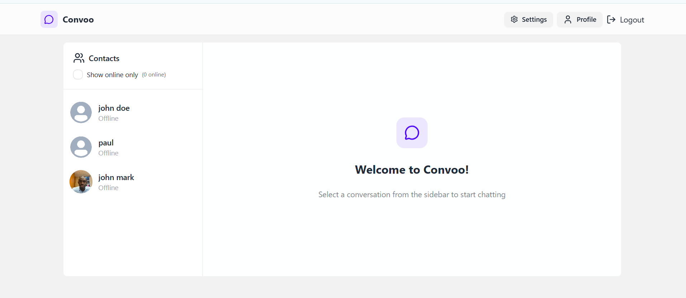

# Full‑Stack Realtime Chat Application

**Live Demo:** https://convoo-8yk5.onrender.com
**Source Code:** https://github.com/Ejoh-Hosea/Convoo

[](https://convoo-8yk5.onrender.com/)

---

## Overview

This project is a **production‑ready full‑stack real‑time chat application** designed to demonstrate modern frontend and backend engineering best practices.

It focuses on:

- real‑time communication
- secure authentication
- scalable state management
- clean, maintainable architecture
- polished UI/UX

The application mirrors patterns used in **real‑world SaaS messaging platforms**, making it a strong portfolio project for **frontend, backend, or full‑stack developer roles**.

---

## Key Highlights 

- **Real‑time messaging** using Socket.io (bi‑directional communication)
- **JWT authentication + HTTP‑only cookies** (secure & production‑grade)
- **Online / offline user presence** tracking
- **Global state management** with Zustand (clean Redux alternative)
- **Theme switching system** (TailwindCSS + DaisyUI)
- **Image upload support** via Cloudinary
- **Centralized error handling** (client & server)
- **Fully responsive UI**
- **Deployed & production‑ready**

---

## 🧱 Tech Stack

### Frontend

- React (Vite)
- TailwindCSS + DaisyUI
- Zustand
- Axios
- Socket.io Client
- React Router
- Lucide Icons

### Backend

- Node.js
- Express
- MongoDB + Mongoose
- Socket.io
- JWT Authentication
- bcryptjs
- Cloudinary
- Cookie‑Parser

---

## Environment Variables

Create a `.env` file inside the **backend** directory:

```env
MONGODB_URI=your_mongodb_uri
PORT=5001
JWT_SECRET=your_jwt_secret

CLOUDINARY_CLOUD_NAME=your_cloud_name
CLOUDINARY_API_KEY=your_api_key
CLOUDINARY_API_SECRET=your_api_secret

NODE_ENV=development
```

---

## Running Locally

### Install dependencies

```bash
# backend
cd backend
npm install

# frontend
cd frontend
npm install
```

### Start development servers

```bash
# backend
npm run dev

# frontend
npm run dev
```

---

## Production Build

```bash
cd frontend
npm run build
```

```bash
cd backend
npm start
```

---

## Why This Project Matters

This project demonstrates my ability to:

- build **scalable full‑stack applications**
- design **secure authentication flows**
- manage **real‑time data**
- write **clean, modular React code**
- structure applications for **production deployment**
- work with **modern frontend tooling**

It reflects the type of work expected in a **junior–mid level developer role**.

---

## Author

**Ejoh Hosea Nwongwe**  
Full‑Stack Developer

- 🌐 Portfolio: https://ejoh-hosea-portfolio.netlify.app/
- 🧑‍💻 GitHub: https://github.com/Ejoh-Hosea
- 📍 Montreal, Canada

---

If you find this project interesting, feel free to star or fork it.
